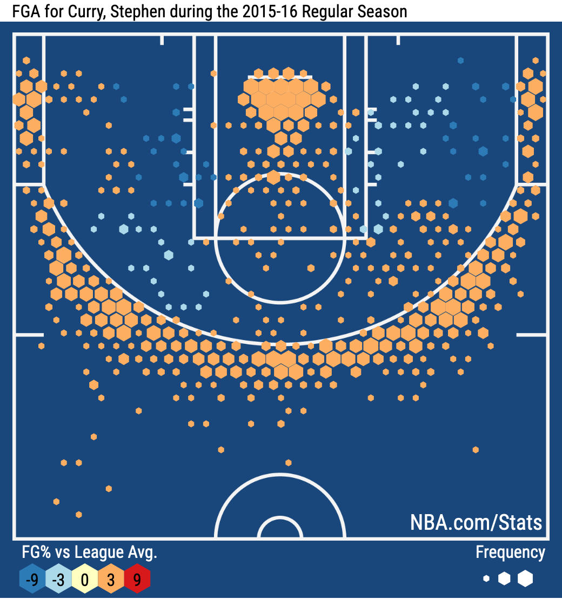
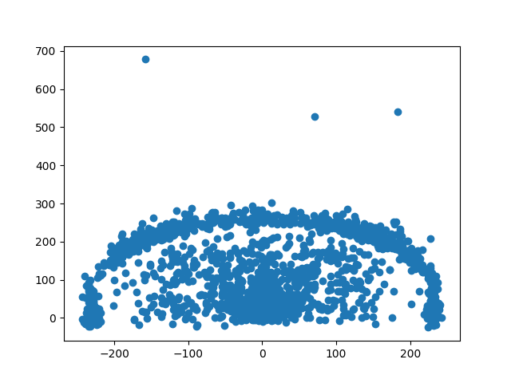
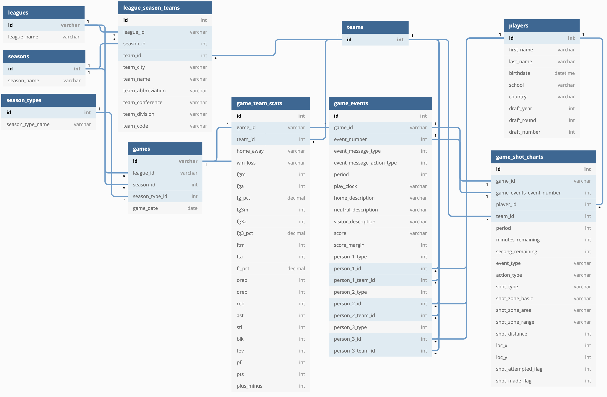
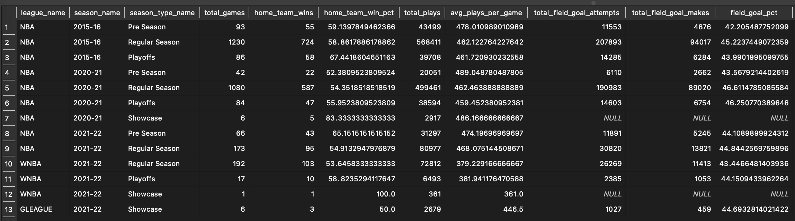
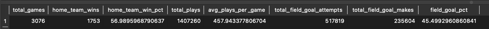

# NBA Stats API and Shot Charts

## TL;DR
*There is an NBA stats API with loads of data. You can use it to build your own shot chart visualizations! Also did you know that the G Leauge only shoots one free throw and get the number of points the original shot was worth if they make it?*

## Background
I am a big NBA fan and love cheering for the Utah Jazz. When I am unable to watch games I always look at the box scores and stats to see how the game went.

In the NBA there has been a huge boom in advanced stats and visualizations in recent years. Teams are using more and more data to gameplan and help players learn what they do well and how they can improve. The NBA has been great at making the data publicly available for people to look at. The NBA website has a section devoted to just stats (https://www.nba.com/stats/).

I often read the play by play of a game to see what happened in certain sequences. Here is an example game of the Utah Jazz (https://www.nba.com/game/ind-vs-uta-0022100172/play-by-play). It even has video available for many of the plays.

Another of my favorite things to look at on the stats page are shot charts. This link (https://www.nba.com/stats/events/?flag=3&CFID=33&CFPARAMS=2015-16&PlayerID=201939&ContextMeasure=FGA&Season=2015-16&section=player&sct=hex) shows Stephen Curry's shot chart from the 2015-16 season, one of the greatest shooting seasons ever.

I noticed that the url for the shot charts has parameters that look like htey feed into an api to get the data for the page. This got me thinking...

## Project Idea and Data Source Exploration

I wanted to see if I could create my own NBA stats database to enable me to create shot charts or play by play logs of games.

I did some research to see if I could find anything out about the API and came across a python package Swar Patel has written to call the NBA stats API (https://github.com/swar/nba_api). I read through the code of the package and found information about different endpoints and parameters. I found that I should be able to write my own etl pipeline to get the needed data to create either shot charts or play by play game logs.

One endpoint is for shot chart details. You can pass parameters in and get a full shot chart log for games. See the shots.csv file for an example game between Cleveland and Washington that I downloaded from the API. It has a row for every field goal attempted in a game, who the player was, and where on the floor the shot happened with loc_x and loc_y fields. This could be layed out on a grid to create a shot chart. See my quick attempt to plot it below and the code in shot_chart.py.

Nice! Looks like the data will work, need to tune the shape of the plot and add the NBA court, but the underlying data will allow creating shot charts.

I also was able to find an endpoint for gameplay logs as well. I won't show example data here, but if you look in the game_events table of the nba_stats.db you can see the end result in the database.

With this exploration I was able to determine that I could create a database with the data needed for creating shot charts and play by play logs pulling from different endpoints of the NBA stats API. With a little more research I found that the API works for the NBA, WNBA, and G League. It contains teams, players, and more for many seasons across the different leagues.

## Data Model and ETL Design

I decided to build a database that would include other dim and fact tables to support the shot data fact table, like leagues, players, teams, seasons, games, etc. I wanted to build with extensibility in mind - this meant being flexible to allow other leagues and seasons.

For ease of development I decided to use SQLite as the database, but built the ETL scripts to enable switching to other types of databases relatively easy. SQLite obviously wouldn't support multiple users and wouldn't be great for larger amounts of data. In a production type environment I would consider using a more robust database like PostrgreSQL or Redshift.

I also made the ETL parameterized using argparse to allow a user to choose which league and date they wanted to run the script for, allowing users to get data from leagues associated with the NBA. This makes it so it can be scheduled to run each morning to load the previous day's game and stats data.

When thinking through design the following questions could guide how to implement the process.
* What if the data was increased 100x?
    * If the data was gettign that big it would make sense to consider moving from a relational database to a NoSQL database. This would make sharding the data easy and allow for horizontal scaling. It would also improve throughput, allowing for rapid ingestion of data.
* The pipelines would be run on a daily basis by 7 AM every day?
    * The ETL script is already parameterized and setup to run for a given day. To schedule it I would consider using something like Apach Airflow. You could schedule a run to happen every day and could track sucesses and failures. It would make backfilling easy as well.
* The database needs to be accessed by 100+ people?
    * When thinking about multiple users accessing the data it might make sense to deploy on the cloud on multiple clusters. One potential option is using AWS EMR. You can easily provision, scale, and reconfigure clusters. It only takes minutes to add a new cluster, rather than having to buy and install new servers manually, it can also automatically manage utilization to save resources and cost. Another thing it would help with is availability by having automatic fail over.

The final ERD can be seen below, and all the create table statements as well where each table is source from is included in the db.py file. I have also included a data dictionary at the end of this file.

The final version of the ETL file is etl.py, you can look there to dig into the code, below I will outline at a high level how the file works.

#### ETL Process:
* Execute File (with league/date parameters)
    * Uses argparse to get the league and date from the execution parameters
* Get Season
    * Use the date to get the season for the chosen league
    * insert it into the seasons table if it doesn't already exist
* Get Teams
    * Call the commonteamyears endpoint with the league and season to get the teams that played in the league that year
    * If the team isn't already in the league_season_teams table call the teaminfocommon endpoint and insert into league_season_teams
* Get Games and Players
    * Call the leaguegamelog endpoint with the league, season, season type, and date
    * If data comes back, delete all gameplay data from the games, game_team_stats, game_events, and game_shot_charts tables
    * For each game
        * Insert into the games and game_team_stats tables
        * Call the playbyplayv2 endpoint with the game_id
        * Get all players in the play by play data
            * If the player isn't in the players table call the commonplayerinfo endpoint and insert into the players table
        * Insert into the game_events table
    * Call the shotchartdetail endpoint
        * Insert into the game_shot_charts table

#### ETL Functions:
* parseArguments() - used for accepting and validating input parameters from the exectuion of the script
* getSeason(ds,league_name) - gets the season of the input league based on the input date
* getData(url,params) - calls an enpoint and returns a dataframe using the given url and parameters
* insertQuery(db_name,query,values) - runs the given query on the given database, using the given values as parameters in the query
* readQuery(db_name,query,values) - uns the given query on the given database, using the given values as parameters in the query, returns a dataframe
* getID(db_name,table,field,value) - gets an id from a given table using a given field and value in the where clause
* insertYear(db_name,season_id,season_name) - checks if a given season_id exists in the seasons table, if it doesn't inserts into the table
* insertTeams(db_name,season_id,season_name,league_id) - gets the teams that played in the given league during the given season and checks to see if they are in the league_season_teams table and if not calls an endpoint to get more data about the team and inserts into the table
* insertGames(db_name,ds,season_id,season_name,league_id) - gets the games and game stats for a given day, league, and season, inserts game data into the games tables (also updates players that don't exist in players table)

#### Running for yourself:
1. Run the db.py script to create your SQLite database and tables
2. Run the etl.py script with optional parameters -ds (date as 'YYYY-MM-DD', defaults to prior day) and -league ('NBA','WNBA','GLEAUGE')
3. PROFIT!!! Query stats and make visualizations to your heart's contec

## Results After Running the ETL
I setup a bash script to loop through a range of dates and run the ETL script passing in the date. I ran the script for the following season/season type for each league:
* NBA 2015-16 Pre Season, Regular Season, and Playoffs
* NBA 2020-21 Pre Season, Regular Season, Playoffs, and Showcase (for the NBA this is the playoffs play-in tournament)
* NBA 2021-22 Pre Season, and Regular Season through 2021-11-11 (current date when this was created)
* WNBA 2021 Regular Season, Playoffs, and Showcase (this is a tournament the WNBA does prior to the season)
* GLEAGUE 2021-22 Showcase (this is a tournament the G League does prior to the season)

After running the ETL process and gathering all the data I ran a couple queries to get a look at the data.

    WITH home_teams AS
    (
        SELECT
            game_id,
            team_id AS home_team_id,
            win_loss AS home_team_win_loss
        FROM game_team_stats
        WHERE home_away = 'home'
    ),
    pbp AS
    (
        SELECT
            game_id,
            count(*) AS total_plays
        FROM game_events
        GROUP BY
            game_id
    ),
    shots AS
    (
        SELECT
            game_id,
            SUM(shot_attempted_flag) AS fga ,
            SUM(shot_made_flag) AS fgm
        FROM game_shot_charts
        GROUP BY
            game_id
    )
    SELECT
        league_name,
        season_name,
        season_type_name,
        COUNT(games.id) AS total_games,
        SUM(CASE WHEN home_team_win_loss = 'W' THEN 1 ELSE 0 END) AS home_team_wins,
        SUM(CASE WHEN home_team_win_loss = 'W' THEN 1 ELSE 0 END) * 100.0
            / COUNT(games.id)  AS home_team_win_pct,
        SUM(total_plays) AS total_plays,
        AVG(total_plays) AS avg_plays_per_game,
        SUM(fga) AS total_field_goal_attempts,
        SUM(fgm) AS total_field_goal_makes,
        SUM(fgm) * 100.0 / SUM(fga) AS field_goal_pct
    FROM games
    INNER JOIN home_teams
        ON games.id = home_teams.game_id
    INNER JOIN leagues
        ON games.league_id = leagues.id
    INNER JOIN seasons
        ON games.season_id = seasons.id
    INNER JOIN season_types
        ON games.season_type_id = season_types.id
    LEFT JOIN pbp
        ON games.id = pbp.game_id
    LEFT JOIN shots
        ON games.id = shots.game_id
    GROUP BY
        league_name,
        season_name,
        season_type_name
    ORDER BY
        leagues.id,
        seasons.id,
        season_types.id

Here are the results from the query:

I also ran the same query getting rid of the aggregation to look at the stats across all leagues/seasons:

As you can see there are about 3 thousand games in the dataset with around 1.4 million individual plays in each game, meaning that on average there are 458 plays in a game. The home team advantage does seem to exist as they win about 57% of the time. The field goal percentage of all shots during the games is about 45%.

When viewing at the aggregate level it does seem that the home team seems to win more frequently during playoff games. That could be because teams are more evenly matched, since it is only the best teams that make it. That might mean more close games where the louder crowds might have a bigger impact.

## Roadbumps and Data Quality
Even when you are pulling data from a source like an API, where you expect to have pretty clean data, there are always issues.

The first issues I encountered were due to assumptions I made without having documentation around the API.
* I had assumed that in the player data that the draft year, draft round and draft number would all be integers. They mostly are, but there are string values as well, for example 'undrafted' for players who were not drafted. This causes issues with database columns set as integer.
* The api calls for game data includes parameters for the 'season type'. This can be Pre Season, Regular Season, or Playoffs in both the NBA and WNBA. When extending the ETL script to cover the G League as well I was having issues getting no game data back even though I knew there were games on the day I entered. After some troubleshooting I found it had to be one of the parameters I was putting in. I we to the G league stats website and found that the season id parameter was 52021. In the season_id parameter the first digit is always the season type. I didn't know what 5 was. I had to go to the G League schedule and found that they have what is called the Showcase Cup before the start of the season. I first tried 'Showcase Cup' as the season type, but still got no data back. I then tried 'Showcase' and was able to get back the game data. Long story short - undocumented APIs lead to assumptions and trial and error about parameters.
* With the NBA and G League the season starts in one year and finishes in the other. I made some logic that says if the ds passed in is on or before September the season year is acutally the prior year. However, the WNBA plays their entire season in the same calendar year. I was running into issues with the code saying the season was the prior season for games in the WNBA, leading to issues with parameters and getting no data back from the API again.

For Data Quality I wanted some general checks, like does the number of teams in the league match what I have in the database and that the number of games on the schedule matched to how many I had in the database. Also I was getting the total score of the game back in the game data and could check that the sum of the play by play event scores matched. Then some other checks include making sure that all game ids in the games table are in the other game stats tables, meaning that all the api calls were succesful.

The queries I ran to check the data quality are available in the data_quality.py file.

The first few were pretty straightforward, but I ran into issues when I was trying to get the point totals from play by play events to match the sum of team total scores in the game_team_stats table. There were 2 issues:
1. There was a duplicate event in one NBA game (id 0022100166 event 177). I need to put a unique constraint on that table for game_id, event_number.
2. It turns out that the G League started a new rule that they only take 1 free throw and get the number of points that the original shot was if they make it. For example if they get fouled on a 3 pointer and make the free throw they get 3 points from one free throw. I was counting all free throws as one point. You can see the investigation and my notes about this in the data_quality.py file. Here is an article about the rule change: https://www.cbssports.com/nba/news/nba-g-league-reportedly-changes-free-throw-rule-single-shot-will-now-count-for-all-potential-points/

## Caveats and Next Steps
As those of you who have dealt with API's before know, ETL processes built using them are very fragile. Also, since the NBA API is not a publicly documented dataset you have to either do your own trial and error to get things right or rely on the efforts of other people who have done so themselves. Also, the NBA API can change at anytime and they don't worry about breaking changes since it isn't a publicly facing API.

I also haven't included much in the way of error handling. When API calls fail the entire script fails. This isn't a huge inconvienince since a daily batch is usually not too big, so re-running isn't that painful. I will need to improve the error handling and logging to improve the quality.

I am planning on scheduling the ETL job to run daily and will work on building a shot chart tool using the data in the database. I would like to create an interface that enables a user to chose a team/player/league/etc. and filter by dimensions such as time in the game/game/season/age/etc.
to create custom shot charts.

*If you got this far thanks for reading and GO JAZZ!*

` `
` `
` `
` `

## DATA DICTIONARY
` `

### **leagues**
| Column  | Description |
| ------------- | ------------- |
| id  | Primary Key (note this is a text field as it can have a leading zero)  |
| league_name | Name of the league (NBA, WNBA, G League) |
` `

## **seasons**
| Column  | Description |
| ------------- | ------------- |
| id  | Primary Key (YYYY)  |
| season_name | The years in the season (YYYY-YY) |
` `

## **season_types**
| Column  | Description |
| ------------- | ------------- |
| id  | Primary Key  |
| season_type_name | Pre Season, Regular Season, Playoffs, or Showcase |
` `

## **teams**
| Column  | Description |
| ------------- | ------------- |
| id  | Primary Key  |
` `

## **league_season_teams**
| Column  | Description |
| ------------- | ------------- |
| id  | Primary Key (Table is unique at the league,season,team grain, because a team can move locations or change names this table holds team metadata instead of the teams table) |
| league_id | Foreign Key to the leagues table |
| season_id | Foreign Key to the seasons table |
| team_id | Foreign Key to the teams table |
| team_city | Where the team is from |
| team_name | Nickname of the team |
| team_abbreviation | Three character abbreviation (i.e. UTA for the Utah Jazz) |
| team_conference | Which league conference the team is in |
| team_division | Which league division the team is in |
| team_code | Code for the team used in the NBA API |
` `

## **players**
| Column  | Description |
| ------------- | ------------- |
| id  | Primary Key  |
| first_name  | First name of the player  |
| last_name  | Last name of the player  |
| birthdate  | Birthdate of the player  |
| school  | University or High School of the player  |
| country  | Country the player is from  |
| draft_year  | Year the player was drafted  |
| draft_round  | Round in which the player was drafted  |
| draft_number  | The pick number at which the player was drafted  |
` `

## **games**
| Column  | Description |
| ------------- | ------------- |
| id  | Primary Key  |
| league_id  | Foreign Key to the leagues table  |
| season_id | Foreign Key to the seasons table |
| season_type_id | Foreign Key to the season_types table |
| game_date  | Date on which the game was played  |

` `

## **game_team_stats**
| Column  | Description |
| ------------- | ------------- |
| id  | Primary Key  |
| game_id  | Foreign Key to the games table  (2 rows in this table for each game - one for the home team one for the road team) |
| team_id | Foreign Key to the teams table (id of the home or away team) |
| home_away | Is this the home or away team (home, away) |
| win_loss  | Did the team win or lose the game (W, L)  |
| fgm  | Field Goals Made  |
| fga  | Field Goals Attempted  |
| fg_pct  | Field Goal Percentage  |
| fg3m  | 3pt Field Goals Made  |
| fg3a  | 3pt Field Goals Attempted  |
| fg3_pct  | 3pt Field Goal Percentage  |
| ftm  | Free Throws Made  |
| fta  | Free Throws Attempted  |
| ft_pct  | Free Throw Percentage  |
| oreb  | Offensive Rebounds  |
| dreb  | Defensive Rebounds  |
| reb  | Total Rebounds  |
| ast  | Assists  |
| stl  | Steals  |
| blk  | Blocks  |
| tov  | Turnovers  |
| pf  | Player Fouls  |
| pts  | Points  |
| plus_minus  | Plus minus  |
` `

## **game_events**
| Column  | Description |
| ------------- | ------------- |
| id  | Primary Key  |
| game_id  | Foreign Key to the games table |
| event_number | Incremental integer of the events during the game (unique within a game) |
| event_message_type | Type of event (1 is made shots, 2 is missed shots, 3 is free throws, etc.) |
| event_message_action_type  | Integer that maps to a description of the event_message_type (i.e. for a shot might be a layup, jump shot, etc.)  |
| period  | Period of the game (1,2,3,4, higher numbers are overtime periods)  |
| play_clock  | Minutes and seconds left in a period (i.e. 12:00)  |
| home_description  | Text description of the play with home team players (uses the event_message_type and event_message_action_type and player names)  |
| neutral_description  | Description of non play events like start/end of periods and games  |
| visitor_description  | Text description of the play with away team players (uses the event_message_type and event_message_action_type and player names)  |
| score  | Score of the game (i.e. 0 - 2 where the first number is the away team)  |
| score_margin  | Home team score minus away team score  |
| person_1_type  | Tells what type of id is in the next columns - 4 is home team player, 5 is away team player, 2 is home team, 3 is away team, 0 means NULL, 6 is home team non player (coach), 7 is away team non player  |
| person_1_id  | id of the player describe in the person type column  |
| person_1_team_id  | id of the team describe in the person type column  |
| person_2_type  | Tells what type of id is in the next columns - 4 is home team player, 5 is away team player, 2 is home team, 3 is away team, 0 means NULL, 6 is home team non player (coach), 7 is away team non player  |
| person_2_id  | id of the player describe in the person type column  |
| person_2_team_id  | id of the team describe in the person type column  |
| person_3_type  | Tells what type of id is in the next columns - 4 is home team player, 5 is away team player, 2 is home team, 3 is away team, 0 means NULL, 6 is home team non player (coach), 7 is away team non player  |
| person_3_id  | id of the player describe in the person type column  |
| person_3_team_id  | id of the team describe in the person type column  |
` `

## **game_shot_charts**
| Column  | Description |
| ------------- | ------------- |
| id  | Primary Key  |
| game_id  | Foreign Key to the games table |
| games_events_event_number | Foreign Key to the games_events table |
| player_id | Foreign key to the players table |
| team_id  | Foreign key to the teams table  |
| period  | Period of the game (1,2,3,4, higher numbers are overtime periods)  |
| minutes_remaining  | Minutes left in a period  |
| seconds_remaining  | Seconds left in a period  |
| event_type  | Was the shot made (Made Shot, Missed Shot)  |
| action_type  | Type of shot (i.e. Jump Shot, Layup Shot)  |
| shot_type  | Was the shot for 2 points or 3 (2PT Field Goal, 3PT Field Goal)  |
| shot_zone_basic  | Zone of the floor where the shot happened  |
| shot_zone_area  | Area of the floor where the shot happened (smaller area than the shot_zone_basic)  |
| shot_zone_range  | How far away from the basket what the shot taken  |
| shot_distance  | Feet from the basket  |
| loc_x  | X coordinates of shot with the court as a grid (along the baseline) |
| loc_y  | Y coordinates of shot with the court as a grid (along the sideline) |
| shot_attempted_flag  | Was a shot attempted (1 - yes, 0 - no, all rows are 1 since this is a table of shot attempts) |
| shot_made_flag  | Was the shot made (1 - yes, 0 - no) |
